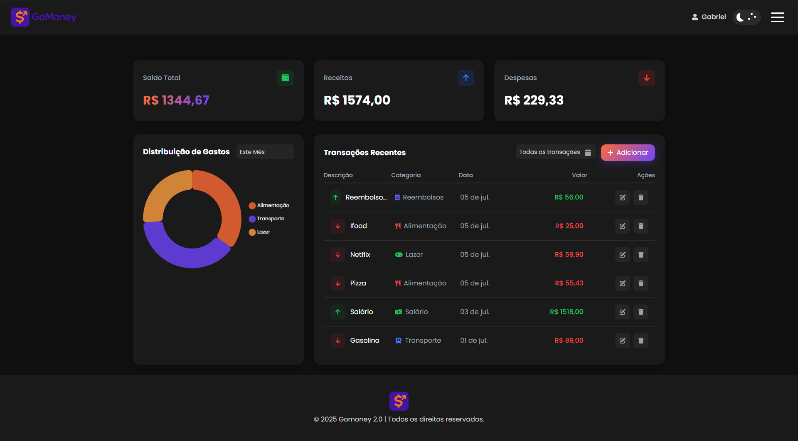
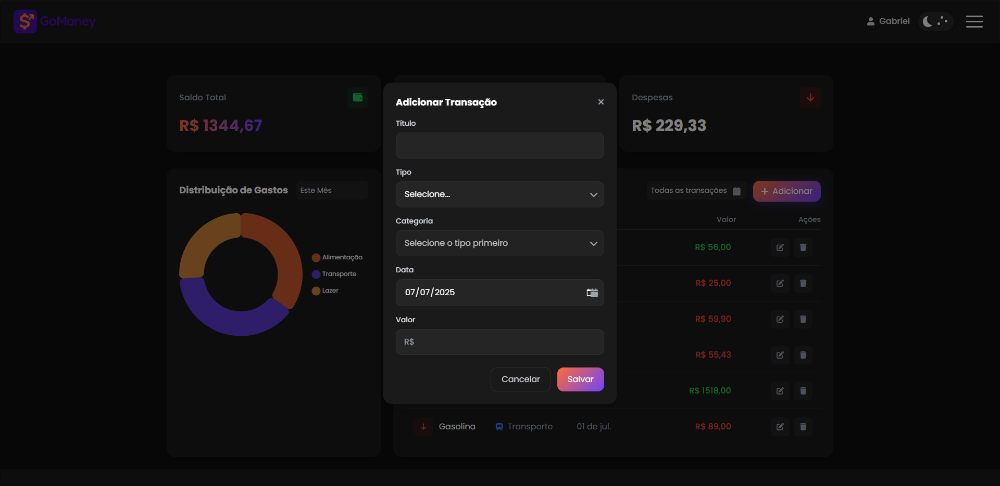
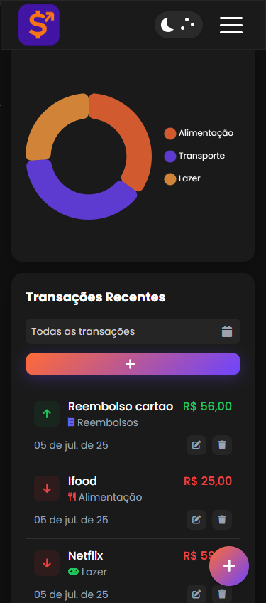

<div align="center">
  
</div>

---

<h1 align="center"> GoMoney</h1>

<h3 align="center">✔ STATUS: Concluído ✔</h3>

---

<h2 align="center">📖Sobre</h2>

<p align="left">Projeto robusto e intuitivo de controle financeiro pessoal, desenvolvido para transformar a gestão das finanças em uma experiência ágil e segura. Ele permite o registro detalhado de receitas e despesas, categorização inteligente dos gastos, e oferece painéis gráficos dinâmicos para análise precisa do fluxo financeiro ao longo do tempo. A aplicação conta com autenticação via token JWT garantindo segurança dos dados do usuário, e uma interface responsiva com suporte a tema claro e escuro, proporcionando excelente usabilidade em qualquer dispositivo. Pensado para entregar resultados reais, ajudando o usuário a tomar decisões financeiras informadas e eficazes. Uma solução completa que alia tecnologia, segurança e design para maximizar o controle financeiro pessoal.</p>

---

<h2 align="center">✔O site contém:</h2>

✅ Autenticação JWT<br>
✅ Filtros por data<br>
✅ Gráficos dinâmicos<br>
✅ Dark mode automático<br>
✅ Backend PHP com MySQL<br>
✅ Modal edição rápida<br>
✅ UI responsiva<br>
✅ API REST<br>
### etc...
---


<h2><a href='https://github.com/gabriell-c/gomoney-API'/>API</a> utilizada</h2>

<h2>Instalando</h2>

```
npm install
```
ou
```
npm i
```

<h2>E logo em seguida:</h2>

```
npm run dev
```

<p>O projeto vai ser iniciado em <a target="_blank" href='http://localhost:5173/'>http://localhost:5173</p>

<h2 align="center">💻Preview</h2>

</img>
<br>
<br>
</img>

<h2 align="center">📱Preview</h2>

</img>
<br>
<br>

---

<h2 align="center">🛠 Tecnologias</h2>
- [React JS](https://react.dev/)
- [Tailwind CSS](https://tailwindcss.com/)
- [Javascript](https://www.javascript.com/)
- [HTML](https://html.com/)
- [CSS](https://developer.mozilla.org/pt-BR/docs/Web/CSS)

---

<h2 align="center">📝Licença</h2>

<p align="center">
   Este repositório está sob licença MIT. Você pode ver o arquivo <a href="https://github.com/gabriell-c/gomoney2.0/blob/main/LICENSE"> LICENSE</a>
   para mais detalhes. 😉
</p>
